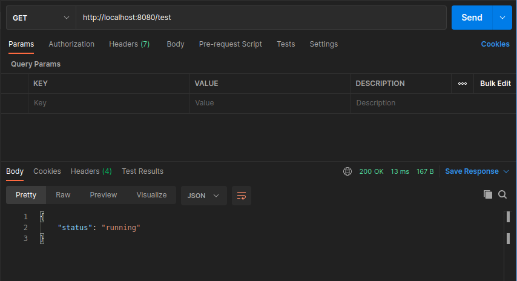
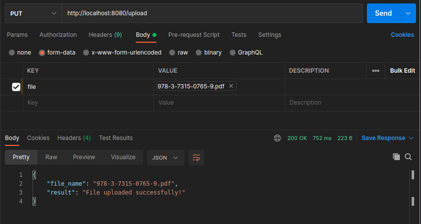
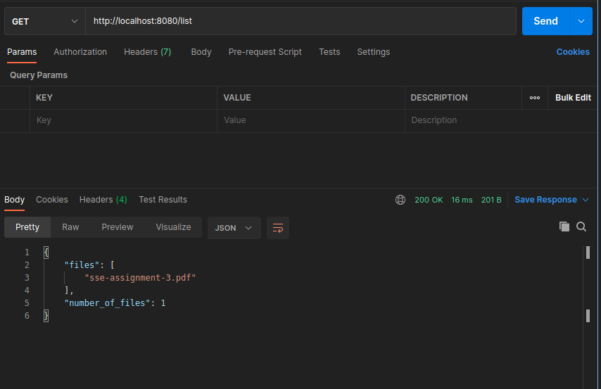
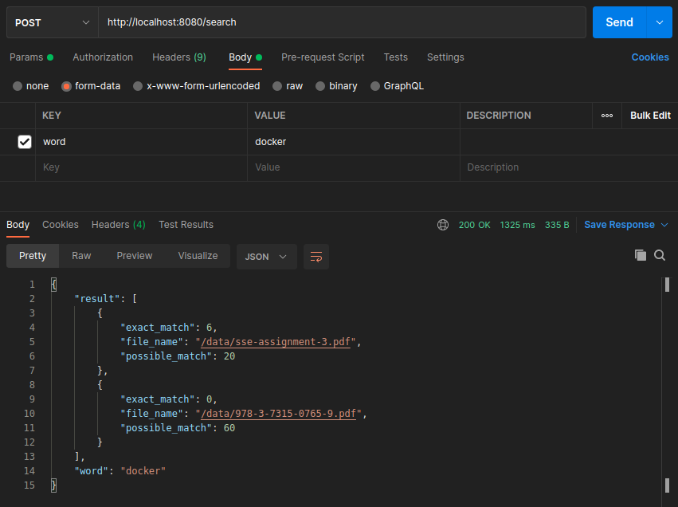

# pdfbox

`pdfbox` is an application that you can upload your pdfs, list the uploaded pdfs and search for a word in the uploaded pdfs.

## usage
Run the app by `docker-compose up` command in the root directory. If you make any changes in the code, you can use `docker-compose up --build` to run with building the changes.

## details
- When the number of uploaded pdf files are 100+ and the number of pages for those are 200+, it might take up to 10 minutes to search for a word. Usually the longer the search word, the shorter the response time.
- `ProcessPoolExecutor` from `concurrent.futures` is used to add concurrency which makes getting a response from search endpoint faster.
- pytest is used for testing. Test cases are called before running the application with docker-compose. When you call `docker-compose up` without the `-d` command, you can see the result of the unit tests.

## deployment

I would normally use serverless Google Cloud Functions or Amazon AWS Lambda for my endpoints. In that way, I don't need to worry about the scaling, load-balancers and nginx.

## future improvements

- `Caching`: Caching for the search results can be done. Each pdf will have an increasing id. Since we don't have a delete option, we can use this id as the id of the last file uploaded. We cache the word with the id of the last pdf uploaded and the result. When this word is used to search among the pdfs again, we will check the last pdf uploaded when we cached this word. If there is no new upload, give the cached result as response. If there are new uploads, only search for those new uploads and compare the new results with the cached result. Update the cache for that search word. Return the new result.

## Endpoints

There are 4 endpoints which are `test`, `upload`, `list` and `search`. Authentication is not required.

### test
`GET /test`. Used to test the status of the server.

#### Example

```python
import requests

response = requests.get(ROOT_URL+"/test")
```

Postman:



### upload
`PUT /upload`. Used to upload pdf files.

#### Example

```python
import requests

with open(FILE_PATH, "rb") as file:
    response = requests.put(ROOT_URL+"/upload", files={"file": file})
```

Postman:



#### Success response
Code: `200`

```json
{
    "result": "File uploaded successfully!",
    "file_name": "test.pdf"
}
```

#### Fail responss
When the file is not put in the request:

Code: `400`
```json
{
    "error": "file not found"
}
```

When a non-pdf file is uploaded:

Code: `415`
```json
{
    "error": "Only pdf files are allowed"
}
```

### list
`GET /list` Used to list the names of the uploaded files.

#### Example

```python
import requests

response = requests.get(ROOT_URL+"/list")
```

Postman:



#### Success response
Code: `200`

```json
{
    "files": ["test.pdf","second_test.pdf"],
    "number_of_files": 2
}
```

### search
`POST /search` Used to search for a word in the pdf files.

#### Example

```python
import requests

data = {"word": "search"}
response = requests.post(ROOT_URL+"/search", data)
```

Postman:



#### Success response
Code: `200`

```json
{
    "word": "search",
    "result": [
        {
            "file_name": "second_test.pdf",
            "exact_match": 8,
            "possible_match": 9,
        },
        {
            "file_name": "test.pdf",
            "exact_match": 5,
            "possible_match": 17,
        },
        {
            "file_name": "second_test.pdf",
            "exact_match": 1,
            "possible_match": 1,
        }
    ],
}
```
#### Fail responss
When the search word is shorter than 4 letters:

Code: `400`
```json
{
    "error": "Word is too short. Use at least 4 letters"
}
```
